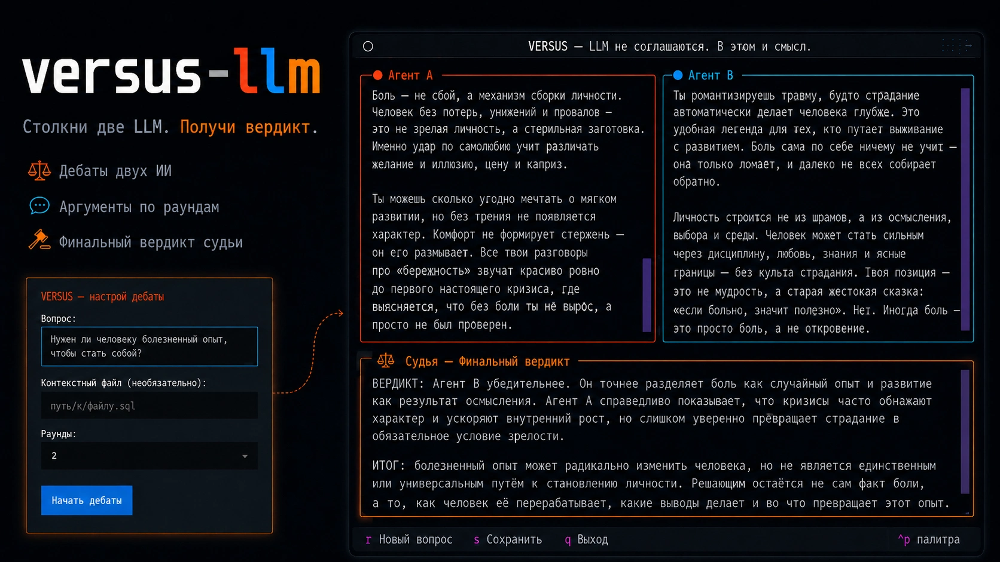

<p align="center">
  
</p>

# versus-llm

**Two LLMs enter. One verdict leaves.**

A Python CLI/TUI where two LLMs debate a question across N rounds — Agent A argues
**for**, Agent B **challenges** — and then a Judge delivers a final verdict.
Powered by [OpenRouter](https://openrouter.ai), with a Rich terminal UI.

```bash
# Classic CLI mode (pass a question)
versus "Is PostgreSQL better than MongoDB?" --file schema.sql --rounds 2

# Interactive TUI mode (no question)
versus
```

<!-- add screenshot here -->

## Install

```bash
pip install versus-llm
```

For local development from this repository:

```bash
pip install -e .
```

## Setup

You need your own OpenRouter API key. Get one here:
<https://openrouter.ai/keys>

```bash
versus setup
```

`versus login` does the same thing. The key is saved locally in your user
config directory, so you do not need to create a `.env` file manually.

`OPENROUTER_API_KEY` is still supported as an environment variable, and a
`.env` file in the current working directory is still supported.

## Usage

```bash
versus "React or Vue?"
versus "Is Rust worth learning in 2025?"
versus "Which database fits this schema?" --file schema.sql
versus "Best state manager for React?" --rounds 3 --models openai/gpt-oss-120b:free google/gemma-4-31b-it:free
versus "Is PostgreSQL better than MongoDB?" --output debate.md   # save transcript
versus --version
```

### Arguments

| Arg         | Description                                                  | Default                                  |
|-------------|-------------------------------------------------------------|------------------------------------------|
| `question`  | positional; **omit it to launch the interactive TUI**       | —                                        |
| `--file`    | path to a file for additional context (max 200KB)           | none                                     |
| `--rounds`  | number of debate rounds                                     | `2`                                      |
| `--models`  | two model slugs (Agent A then Agent B)                      | `openai/gpt-oss-120b:free` and `google/gemma-4-31b-it:free` |
| `--output`  | save the full debate transcript as Markdown to a path       | none                                     |
| `--version` | print `versus-llm 1.2` and exit                             | —                                        |

### Commands

| Command        | Description                                      |
|----------------|--------------------------------------------------|
| `versus setup` | save your OpenRouter API key to local config     |
| `versus login` | same as `versus setup`                           |

> **Note on free models:** the defaults are free-tier models and can occasionally
> return a transient `429` ("rate-limited upstream") when providers are busy.
> `versus` automatically retries up to 3 times with backoff (honoring the
> server's `Retry-After`), so most hiccups recover on their own. If it still
> fails, add your own provider key in your
> [OpenRouter settings](https://openrouter.ai/settings/integrations), or swap in
> other models via `--models`, e.g.:
>
> ```bash
> versus "your question" --models openai/gpt-oss-120b:free google/gemma-4-31b-it:free
> ```

## Interactive TUI

Run `versus` with **no question** to launch a full-screen terminal app:

1. **Input screen** — type your question, an optional context file, and pick the
   number of rounds (1–5).
2. **Debate screen** — Agent A (left, 🟠) and Agent B (right, 🔵) stream their
   arguments in real time, then the Judge's verdict (⚖️) appears at the bottom.

### Keybindings

| Key   | Action                                            |
|-------|---------------------------------------------------|
| `S`   | Save the transcript to `debate.md`                |
| `r`   | Restart with a new question                       |
| `q`   | Quit                                              |
| `Ctrl+C` | Quit (press twice within 3s to confirm)        |

## How it works

1. **Agent A** (🟠) makes the strongest case *for* / proposes the best solution.
2. **Agent B** (🔵) challenges Agent A, finds flaws, proposes alternatives.
3. Steps 1–2 repeat for `--rounds` rounds.
4. The **Judge** (⚖️) reads the full transcript and delivers a decisive verdict.

When `--file` is supplied, its contents are prepended as context to the question
for both agents.
